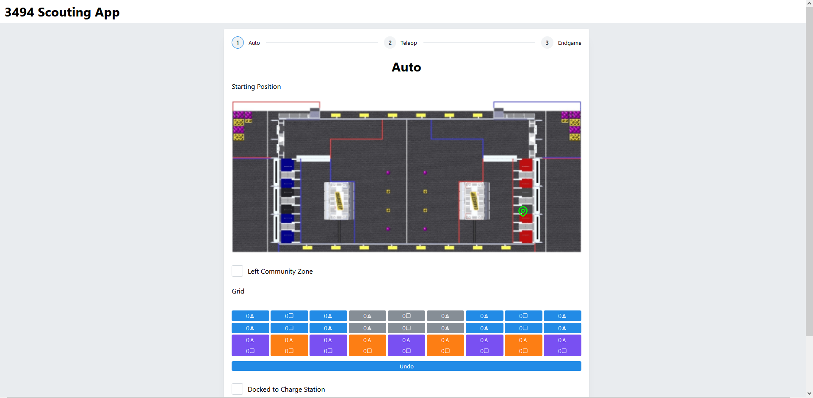

    <h1>3494 Scouting</h1>
    
A modern scouting app developed by Team 3494 The Quadrangles

    

## Features

Implemented as a React/Vite [progressive web application](https://web.dev/progressive-web-apps/),
the entire application is cached on the users device, allowing the app to be used, even in the
absence of Wi-Fi.

## Contributing

Feel free to open a GitHub issue if you're interested in seeing any features or contributing.
For more casual comments, contact Kennan#4955 on discord.
